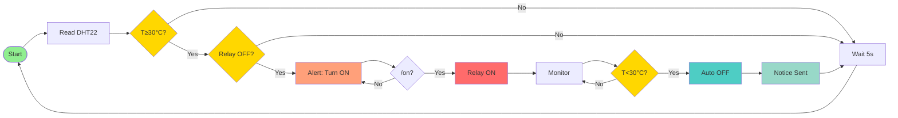

# 🤖LAB1: Temperature Sensor with Relay Control (Telegram) 
Lab instruction is [HERE](https://theara-seng.github.io/files/IOT/lab1.pdf)

## 🧰Overview
This project uses an ESP32 to track temperature, send updates to your phone via Telegram, and manage a relay automatically or by hand.
### Features
• Constant Tracking: Checks the temperature every 5 seconds using a DHT22 sensor.</br>
• Telegram Alerts: The system texts you updates and lets you send back commands.</br>
• Auto & Manual Control: The switch turns on/off based on the heat, but you can also control it yourself remotely.</br>
### Equipments
• ESP32 Dev Board (MicroPython firmware flashed) </br>
• DHT22 sensor </br>
• Relay module </br>
• jumper wires </br>
• USB cable + laptop with Thonny </br>
• Wi-Fi access (internet) </br>
### Wiring


### Telegram Bot Setup

#### Step 1: Create Telegram Bot
1. **Open Telegram** and search for `@BotFather`
2. **Start chat** with BotFather and send `/newbot`
3. **Choose bot name** (e.g., "MyESP32Bot")
4. **Choose username** (must end with 'bot', e.g., "myesp32_bot")
5. **Copy the bot token** (format: `123456789:ABCdefGHIjklMNOpqrsTUVwxyz`)

#### Step 2: Get Group Chat ID
1. **Create a Telegram group** or use existing one
2. **Add your bot** to the group
3. **Add @myidbot** in the group
4. **Start chat**: with @myidbot and send /getgroupid@myidbot 
5. **Find your group chat ID** (negative number like `-1234567890`)

### Software Configuration

#### Configure Code Settings
Edit the configuration in `main.py`:
```python
# -------- SETTINGS --------
SSID = "YourWIFI"
PASSWORD = "YourWIFIPassword"

BOT_TOKEN = "YourBOT_TOKEN"
CHAT_ID = "YourCHAT_ID"
```
#### Upload the Code
1. **Connect ESP32** to a computer's USB port
2. **Use Thonny IDE** or similar tool
3. **Upload** `main.py` to ESP32
4. **Reset** ESP32 to start program


## Task 1-Sensor Read & Print
• Read DHT22 every 5 seconds and print the temperature and humidity with 2 
decimals. </br>


## Task 2-Telegram Send
• Implement send_message() and post a test message to group chat. </br>


## Task 3-Bot Command
• Implement /status to reply with current T/H and relay state.  </br>
• Implement /on and /off to control the relay. </br>


## Task 4-Bot Command
• No messages while T < 30 °C. </br>
•  If T ≥ 30 °C and relay is OFF, send an alert every loop (5 s) until /on is 
received.  </br>
• After /on, stop alerts. When T < 30 °C, turn relay OFF automatically and send 
a one-time “auto-OFF” notice.  </br>
• The demonstration video is [HERE](https://youtu.be/EPEahFAGosI?si=evPU2CnT-OClJXCK)

## Task 6 Flowchart 



