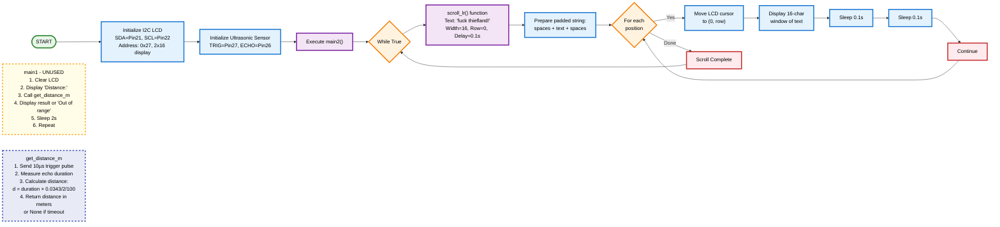

# 🛜LAB2: IoT Webserver with LED, Sensors, and LCD Control
Lab instruction is [HERE](https://theara-seng.github.io/files/IOT/LAB2_Webserver_LCD_Control.pdf)

## 🧰Overview
In this lab, we will design an ESP32-based IoT system using MicroPython that bridges the gap between a web interface and physical hardware. We will also build a system to control an LED, monitor sensor data, and push custom text to an LCD display directly from a web browser.  
By focusing on event-driven IoT design, we will gain hands-on experience in making hardware respond in real-time to digital commands through a custom web server.
### Features
• Implement a MicroPython webserver to serve HTML controls.  
• Control an LED from the web page.  
• Read data from DHT11 and ultrasonic sensors and expose it on the webserver.  
• Use web buttons to selectively show temperature and distance on an LCD (I²C).  
• Send custom text from a textbox to display on the LCD.  
• Document wiring, interface behavior, and system operation. 
### Equipments
• ESP32 Dev Board (MicroPython firmware flashed)  
• DHT11 sensor (temperature/humidity)  
• HC-SR04 ultrasonic distance sensor  
• LCD 16×2 with I²C backpack  
• Breadboard, jumper wires  
• USB cable + laptop with Thonny  
• Wi-Fi access 
### Wiring

### Set Up
...
## Task 1 - LED Control
• Add two buttons (ON/OFF) on the web page.  
• When clicked, LED on GPIO2 should turn ON or OFF.  
• Video link is [HERE]()
## Task 2 - Sensor Read
• Read DHT11 temperature and ultrasonic distance.   
• Show values on the web page (refresh every 1-2 seconds).   

## Task 3 - Sensor → LCD
• Add two buttons:   
  - Show Distance → writes distance to LCD line 1. 
  - Show Temp → writes temperature to LCD line 2. 
  
## Task 4 - Textbox → LCD
• Add a textbox + “Send” button on the web page.   
• User enters custom text → LCD displays it (scroll if >16 chars).   
• Video link is <a href="https://youtube.com/shorts/7-j0wPhD0Rk?si=Z3Fr2QL3oJA7VomG"> CLICK ME </a>
 
### Diagram

