# LAB 4: Multi-Sensor IoT Monitoring with Grafana Dashboard

## Overview

This project implements a **multi-sensor IoT monitoring system** using an **ESP32** microcontroller and **MicroPython**. The system reads data from four sensors, applies edge processing logic on the device, and publishes structured JSON payloads over **MQTT** to **Node-RED**, which stores the data in **InfluxDB** and visualizes it in **Grafana**.

---

## Hardware Components

| Component | Role | Interface | ESP32 Pin |
|-----------|------|-----------|-----------|
| ESP32 | Main microcontroller | — | — |
| MLX90614 | IR body & ambient temperature | I2C | SDA = GPIO 21, SCL = GPIO 22 |
| MQ-5 | Gas / smoke sensor | ADC 12-bit | GPIO 33 |
| BMP280 | Pressure & altitude | I2C | SDA = GPIO 21, SCL = GPIO 22 |
| DS3231 | Real-time clock (RTC) | I2C | SDA = GPIO 21, SCL = GPIO 22 |

> ⚠️ All three I2C sensors share the same bus on SDA = GPIO 21 and SCL = GPIO 22 at 100 kHz.  
> ⚠️ MQ-5 VCC is connected to **3.3V** (not 5V) to avoid burning the sensor.

---

## System Architecture

```
[Sensors] → [ESP32 Edge Processing] → [MQTT Broker] → [Node-RED] → [InfluxDB] → [Grafana]
```

### Data Flow

1. ESP32 connects to Wi-Fi and the MQTT broker on boot.
2. All four sensors are read every **2 seconds** in a continuous loop.
3. Edge logic is applied on the ESP32 before transmission (filtering, classification, fever detection).
4. A JSON payload is built and published via MQTT to topic `/aupp/esp32/songhabot`.
5. Node-RED subscribes to the topic, parses the payload, and writes it to InfluxDB.
6. Grafana queries InfluxDB and displays live dashboard panels.

---

## Network & MQTT Configuration

These values are set at the top of `main.py`:

```python
SSID      = "TP-LINK_56C612"
PASSWORD  = "06941314"
BROKER    = "test.mosquitto.org"
PORT      = 1883
CLIENT_ID = b"esp32_random_1"
TOPIC     = b"/aupp/esp32/songhabot"
KEEPALIVE = 30
```

> The code uses a **20-second Wi-Fi timeout**. If the board cannot connect within that window it raises a `RuntimeError`. The MQTT client auto-reconnects on `OSError` with a 3-second retry delay.

---

## Edge Processing Logic

### Task 1 — Gas Filtering (Moving Average)

The raw MQ-5 ADC value (12-bit, 0–4095) is converted to voltage and smoothed with a 5-sample moving average:

```python
gas_value = mq5.read()
voltage   = (gas_value / 4095) * 3.3      # convert ADC to volts
vol_data.insert(0, voltage)               # prepend newest reading
if len(vol_data) > 5:
    vol_data = vol_data[:5]               # keep only last 5 samples
avg_vol = average(vol_data)               # avg = sum(buffer) / len
```

- Both raw voltage and averaged voltage are printed to the Serial Monitor.
- Only `avg_voltage` is included in the published JSON payload.

### Task 2 — Gas Risk Classification

The raw ADC integer value is passed to `risk_level()`:

```python
def risk_level(gas=0):
    if gas >= 2600:
        return 'DANGER'
    elif gas >= 2100:
        return 'WARNING'
    return 'SAFE'
```

| Condition | risk_level |
|-----------|------------|
| `gas_value < 2100` | `SAFE` |
| `2100 <= gas_value <= 2599` | `WARNING` |
| `gas_value >= 2600` | `DANGER` |

The result is published as the `risk_level` field in the JSON payload.

### Task 3 — Fever Detection

Body temperature is read from the MLX90614 object temperature and evaluated:

```python
FEVER_THRESHOLD = 32.5    # °C

def detect_fever(body_temp):
    return 1 if body_temp >= FEVER_THRESHOLD else 0
```

| Condition | fever_flag | Status |
|-----------|------------|--------|
| `body_temp >= 32.5 °C` | `1` | FEVER |
| `body_temp < 32.5 °C` | `0` | NORMAL |

Both `body_temp` and `ambient_temp` are read from the MLX90614 and included in the payload.

### Task 4 — Pressure, Altitude & Timestamp

BMP280 pressure is read in **Pa** and converted to hPa. Altitude is derived using the barometric formula:

```python
SEA_LEVEL_PA = 101325    # standard sea-level pressure in Pa

pressure_pa  = bmp.pressure
pressure_hpa = round(pressure_pa / 100, 2)

def calc_altitude(pressure_pa):
    return round(44330.0 * (1.0 - (pressure_pa / SEA_LEVEL_PA) ** 0.1903), 2)

altitude_m = calc_altitude(pressure_pa)
```

Timestamp is retrieved from the DS3231 RTC and formatted as a readable datetime string:

```python
def get_timestamp(rtc):
    dt = rtc.datetime()    # [year, month, day, hour, minute, second]
    return "{:04d}-{:02d}-{:02d} {:02d}:{:02d}:{:02d}".format(
        dt[0], dt[1], dt[2], dt[3], dt[4], dt[5])
```

---

## JSON Payload Structure

The following payload is published to the MQTT topic every 2 seconds:

```json
{
  "timestamp"    : "2025-01-01 10:30:00",
  "avg_voltage"  : 1.876,
  "risk_level"   : "WARNING",
  "ambient_temp" : 28.5,
  "body_temp"    : 36.8,
  "fever_flag"   : 1,
  "pressure_hpa" : 1013.25,
  "altitude_m"   : 48.5
}
```

---

## Grafana Dashboard Panels

| Panel | Type | JSON Field |
|-------|------|------------|
| Gas Average Voltage | Time Series | `avg_voltage` |
| Risk Level | Stat Display | `risk_level` |
| Body Temperature | Gauge | `body_temp` |
| Ambient Temperature | Gauge | `ambient_temp` |
| Pressure | Time Series | `pressure_hpa` |
| Altitude | Time Series | `altitude_m` |

---

## File Structure

```
lab4/
├── main.py                    # MicroPython source code (ESP32)
├── flowchart.md               # System flowchart (Mermaid)
├── node_red_flow.json         # Node-RED flow export
├── README.md                  # This file
└── screenshots/
    ├── serial_monitor.png     # Raw vs averaged voltage (Task 1)
    ├── risk_states.png        # SAFE / WARNING / DANGER demo (Task 2)
    ├── fever_detection.png    # Fever flag 0 and 1 demo (Task 3)
    ├── influxdb_data.png      # InfluxDB data view
    └── grafana_dashboard.png  # Full Grafana dashboard (Task 4)
```

---

## Setup Instructions

### 1. Flash MicroPython to ESP32

Download the latest MicroPython firmware from [micropython.org](https://micropython.org/download/esp32/) and flash it:

```bash
esptool.py --port COM3 erase_flash
esptool.py --port COM3 write_flash -z 0x1000 micropython.bin
```

### 2. Install Required MicroPython Libraries

Upload the following library files to the ESP32 root using **Thonny IDE** (File → Save as → MicroPython device):

- `bmp280.py`
- `mlx90614.py`
- `ds3231.py`
- `umqtt/simple.py`

### 3. Update Wi-Fi & MQTT Credentials

Edit the constants at the top of `main.py` to match your network:

```python
SSID      = "your_wifi_name"
PASSWORD  = "your_wifi_password"
BROKER    = "test.mosquitto.org"   # or your local broker IP
PORT      = 1883
CLIENT_ID = b"esp32_random_1"      # must be unique per device
TOPIC     = b"/aupp/esp32/songhabot"
```

### 4. Run the Code

Open `main.py` in **Thonny**, connect to the ESP32, and press **Run**. The Serial Monitor will print output like:

```
WiFi OK: ('192.168.1.x', ...)
MQTT connected

Task1: Raw VS Average voltages:
    Raw    : 1.872 V
    Average: 1.869 V

Task2:
    Risk Level: WARNING

Task3 (Fever Detection):
    Ambient Temp: 28.5 °C
    Body Temp   : 36.8 °C
    Fever Flag  : 1 FEVER

Task4 (BMP280 + DS3231):
    Pressure : 1013.25 hPa
    Altitude : 48.5 m
    Timestamp: 2025-01-01 10:30:00

Sent: {"timestamp": "2025-01-01 10:30:00", "avg_voltage": 1.869, ...}
```

### 5. Import Node-RED Flow

In Node-RED, go to **Menu → Import** and load `node_red_flow.json`. Ensure the MQTT input node subscribes to `/aupp/esp32/songhabot` and the InfluxDB output node is configured to your database.

### 6. Set Up InfluxDB

- Create a database (e.g. `iot_lab4`) matching the name used in your Node-RED flow.
- Confirm the Node-RED InfluxDB node points to the correct host and port (default `localhost:8086`).

### 7. Configure Grafana

- Add InfluxDB as a data source under **Configuration → Data Sources**.
- Create panels using the JSON field names listed in the Grafana Dashboard Panels section above.

---

## Dependencies

| Dependency | Purpose |
|------------|---------|
| MicroPython firmware (ESP32) | Runtime environment |
| `bmp280.py` | BMP280 pressure / altitude driver |
| `mlx90614.py` | MLX90614 IR temperature driver |
| `ds3231.py` | DS3231 RTC driver |
| `umqtt.simple` | MQTT client for MicroPython |
| `ujson`, `network`, `machine`, `math` | Built-in MicroPython modules |
| Node-RED + `node-red-contrib-influxdb` | Data routing and storage |
| InfluxDB v1.x | Time-series database |
| Grafana | Dashboard visualization |

---

## Flowchart 

```mermaid
flowchart TD
    START([" START "])
    START --> WIFI

    WIFI["wifi_connect()
    ───────────────────────────────
    wlan.active = True
    wlan.connect with SSID and PASSWORD
    Timeout after 20 seconds"]

    WIFI --> WIFI_OK{"Wi-Fi
    connected?"}
    WIFI_OK -->|"NO — timeout"| ERR1[" Raise RuntimeError "]
    WIFI_OK -->|"YES"| INIT

    ERR1 --> STOP_ERR([" END "])

    INIT["Initialize Hardware
    ───────────────────────────────
    i2c = I2C 0 · scl=22 · sda=21 · 100kHz
    mlx = MLX90614 on i2c
    bmp = BMP280 on i2c
    rtc = DS3231 · sda=21 · scl=22
    mq5 = ADC Pin 33 · ATTN_11DB · 12BIT
    vol_data = empty list"]

    INIT --> MQTT_CONN

    MQTT_CONN["connect_mqtt()
    ───────────────────────────────
    client = MQTTClient
    broker = test.mosquitto.org
    port   = 1883
    client.connect()"]

    MQTT_CONN --> MQTT_OK{"MQTT
    connected?"}
    MQTT_OK -->|"OSError"| RETRY["client.close()
    print Retrying in 3s
    time.sleep 3"]
    RETRY --> MQTT_CONN
    MQTT_OK -->|"YES"| LOOP_START

    LOOP_START(["  MAIN LOOP — every 2 seconds  "])

    LOOP_START --> T1_READ

    %% ── TASK 1 ──────────────────────────────
    T1_READ["TASK 1 · Gas Sensor Read
    ───────────────────────────────
    gas_value = mq5.read()
    voltage = gas_value / 4095 x 3.3"]

    T1_READ --> T1_BUF["Update Circular Buffer
    ───────────────────────────────
    vol_data.insert 0 · voltage
    if len > 5 · keep first 5 only"]

    T1_BUF --> T1_AVG["Compute Moving Average
    ───────────────────────────────
    avg_vol = sum of vol_data / len
    Print raw voltage and avg_vol"]

    %% ── TASK 2 ──────────────────────────────
    T1_AVG --> T2_CLASS{"TASK 2 · risk_level gas_value
    ───────────────────────────────
    What is gas_value?"}

    T2_CLASS -->|"gas_value >= 2600"| DANGER["risk = DANGER"]
    T2_CLASS -->|"gas_value >= 2100"| WARNING["risk = WARNING"]
    T2_CLASS -->|"gas_value < 2100"| SAFE["risk = SAFE"]

    DANGER --> T3
    WARNING --> T3
    SAFE --> T3

    %% ── TASK 3 ──────────────────────────────
    T3["TASK 3 · MLX90614 Read
    ───────────────────────────────
    body_temp  = mlx.read_object_temp()
    amb_temp   = mlx.read_ambient_temp()
    Print both temperatures"]

    T3 --> FEVER_CHECK{"detect_fever body_temp
    ───────────────────────────────
    body_temp >= 32.5 °C?"}

    FEVER_CHECK -->|"YES"| FEVER["fever_flag = 1
    Print FEVER"]
    FEVER_CHECK -->|"NO"| NORMAL["fever_flag = 0
    Print NORMAL"]

    FEVER --> T4
    NORMAL --> T4

    %% ── TASK 4 ──────────────────────────────
    T4["TASK 4 · BMP280 and DS3231
    ───────────────────────────────
    pressure_pa  = bmp.pressure
    pressure_hpa = pressure_pa / 100
    altitude_m   = calc_altitude pressure_pa
    timestamp    = get_timestamp rtc
    Print pressure · altitude · timestamp"]

    %% ── JSON ────────────────────────────────
    T4 --> BUILD_JSON["Build JSON Payload
    ───────────────────────────────
    timestamp     · avg_voltage
    risk_level    · ambient_temp
    body_temp     · fever_flag
    pressure_hpa  · altitude_m"]

    %% ── PUBLISH ─────────────────────────────
    BUILD_JSON --> PUBLISH["client.publish TOPIC · msg
    ───────────────────────────────
    topic = /aupp/esp32/songhabot
    Print Sent and payload"]

    PUBLISH --> SLEEP["time.sleep 2"]

    SLEEP --> OSERR{"OSError
    during loop?"}
    OSERR -->|"NO"| LOOP_START
    OSERR -->|"YES"| RETRY2["client.close()
    Print MQTT error
    time.sleep 3"]
    RETRY2 --> MQTT_CONN

    %% ── STYLES ──────────────────────────────
    classDef startEnd   fill:#1f6feb,stroke:#58a6ff,color:#ffffff,font-weight:bold
    classDef process    fill:#161b22,stroke:#30363d,color:#c9d1d9
    classDef decision   fill:#161b22,stroke:#d29922,color:#e3b341,font-weight:bold
    classDef safe       fill:#0f2d1a,stroke:#3fb950,color:#3fb950,font-weight:bold
    classDef warning    fill:#2d1f00,stroke:#d29922,color:#e3b341,font-weight:bold
    classDef danger     fill:#2d0f0f,stroke:#f85149,color:#f85149,font-weight:bold
    classDef fever      fill:#2d0f0f,stroke:#f85149,color:#f85149,font-weight:bold
    classDef normal     fill:#0f2d1a,stroke:#3fb950,color:#3fb950,font-weight:bold
    classDef json       fill:#1a1a2e,stroke:#79c0ff,color:#79c0ff,font-weight:bold
    classDef publish    fill:#1a2e1a,stroke:#3fb950,color:#56d364,font-weight:bold
    classDef error      fill:#2d0f0f,stroke:#f85149,color:#f85149

    class START,LOOP_START startEnd
    class STOP_ERR,ERR1 error
    class WIFI,INIT,MQTT_CONN,T1_READ,T1_BUF,T1_AVG,T3,T4,SLEEP process
    class RETRY,RETRY2 error
    class WIFI_OK,MQTT_OK,T2_CLASS,FEVER_CHECK,OSERR decision
    class SAFE,NORMAL normal
    class WARNING warning
    class DANGER,FEVER danger
    class BUILD_JSON json
    class PUBLISH publish
```


