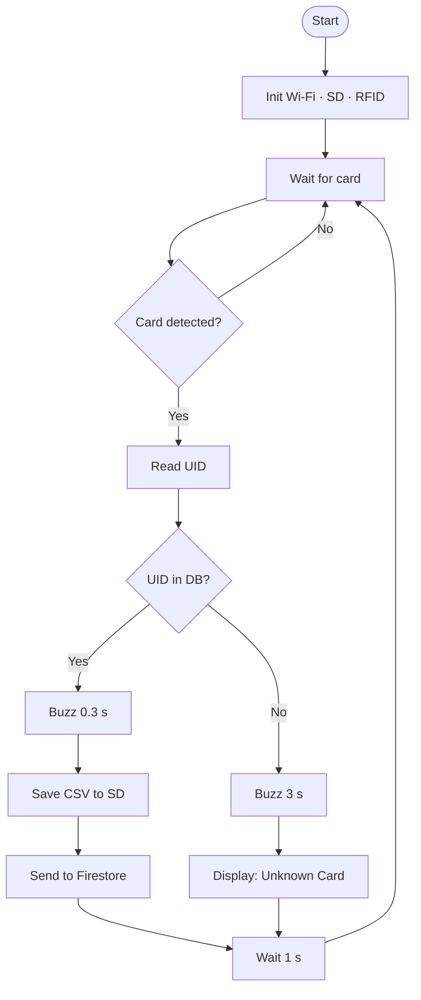

# LAB 6 – Smart RFID System with Cloud & SD Logging

## Overview
A smart RFID-based attendance system built on **ESP32** running **MicroPython**.  
Cards are scanned, matched against a student database, logged locally to an SD card (CSV) and remotely to **Firebase Firestore**, with buzzer feedback.

---

## Hardware Components


</br>

> ⚠️ **Warning:** Do NOT connect the RC522 to 5V — it will be permanently damaged. Use 3.3V only.

---

## Software Requirements

- **MicroPython** firmware on ESP32
- **Thonny IDE** for flashing and running scripts
- Libraries required on the ESP32:
  - `mfrc522.py` – RFID driver
  - `sdcard.py` – SD card driver
  - `ntptime` – built-in MicroPython NTP module
  - `urequests`, `ujson`, `network` – built-in MicroPython modules

---

## Setup Instructions

1. Flash MicroPython firmware to the ESP32.
2. Upload `mfrc522.py` and `sdcard.py` to the ESP32 root using Thonny.
3. Open `main.py` in Thonny and update:
   ```python
   WIFI_SSID     = "YOUR_WIFI_SSID"
   WIFI_PASSWORD = "YOUR_WIFI_PASSWORD"
   FIREBASE_PROJECT = "your-firebase-project-id"
   ```
4. Add your card UIDs and student info to `STUDENT_DB`:
   ```python
   STUDENT_DB = {
       "AABBCCDD": {"name": "Your Name", "student_id": "S001", "major": "Your Major"},
   }
   ```
   > To find a card's UID: run a quick scan loop and print the raw bytes.
5. Upload `main.py` to the ESP32 and run it.

---

## CSV Format (attendance.csv on SD card)

```
UID,Name,StudentID,Major,DateTime
```

---

## Firestore Structure

Collection: `attendance`  
Each document contains the fields:

| Field       | Type   |
|-------------|--------|
| uid         | string |
| name        | string |
| student_id  | string |
| major       | string |
| datetime    | string |

---

## Flowchart

---

## Demo
Watch the demo video [HERE](https://youtube.com/shorts/XH15WrsqP2A?si=evbjc12V1XGwkeqo).
